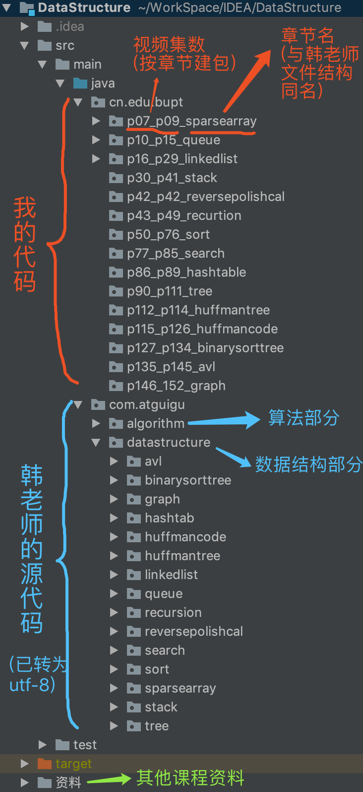

视频地址：https://www.bilibili.com/video/av54029771/

1. 原韩老师的文件格式是GBK和GB2312，可能会出现乱码情况，现工程都被转换为UTF-8。

2. 项目使用IDEA写的，用maven管理的jar包，不过毕竟是基础的数据结构，并没有几个jar包，都主要是测试用的，不导入也不影响主代码。

3. 不是跟着韩老师的代码写的，是加入了自己的思考重写的，但是实现了相同的功能。自认为代码逻辑比韩老师更清晰，但是注释不如韩老师多。

4. 课后习题答案都基本实现。

5. 我觉得，根据韩老师课程，自己写代码，再对比我写的代码，会收获颇多。

6. 韩老师有些地方面向对象的思想用的不太好吧,有些方法不该写在某些类中,比如栈章节中计算表达式部分,ArrayStack里不应写优先级的方法,思想不太好吧.

欢迎批评指正 502358401@qq.com

附项目结构:

---
>  
---